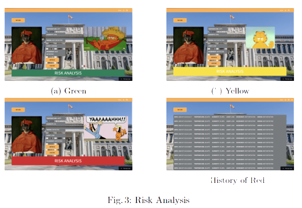
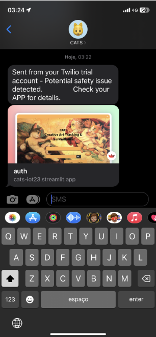

<br/>
<p align="center">
  <a href="https://github.com/rain-ho/cats">
    
  </a>
  <h3 align="center">CATS   
</h3>

  <p align="center">
            CREATIVE ART TRACKING & SURVEILLANCE
    <br/>
    <br/>
    <a href="https://github.com/rain-ho/cats"><strong>Explore the docs »</strong></a>
    <br/>
    <br/>
    [View Demo](https://cats-iot23.streamlit.app) 
    .
    <a href="https://github.com/rain-ho/cats/issues">Issues</a>
    .
    <a href="https://github.com/rain-ho/cats/discussions">Discussions</a>
  </p>
</p>


## Table Of Contents

* [About the Project](#about-the-project)
* [Key Features](#key-features)
* [How to Use CATS](#how-to-use-cats)
* [Technology Stack](#technology-stack)
* [Image Gallery](#image-gallery)
* [Contributing](#contributing)
* [Authors](#authors)
* [Acknowledgements](#acknowledgements)


## About the Project
CATS (Creative Art Tracking & Surveillance) is an innovative Internet of Things (IoT) project designed for the protection and preservation of artworks in a museum setting. Each artwork in the museum is equipped with a unique ID attached to a Zoleria board, which serves as the core sensor module. The Zoleria board collects real-time data on various environmental factors surrounding the artwork, including temperature, humidity, air quality, light levels, and movement.

The primary objective of CATS is to ensure the optimal conditions for the artworks' preservation. By continuously monitoring the environmental conditions, the system can detect potential risks that might compromise the artwork's integrity. This data-driven approach helps prevent damage caused by unfavorable conditions and allows for timely intervention before any harm is done.

## Key Features
* Real-time Data Collection: The Zoleria board gathers data on temperature, humidity, air quality, light, and movement around the artwork.

* Risk Analysis: The collected data is sent to the cloud, where it undergoes a risk analysis. This analysis compares the environmental conditions against specific thresholds defined for each artwork.

* SMS Notifications: If the risk analysis indicates a potential threat to the artwork, CATS triggers an SMS notification. The alert is sent to the designated person in charge, ensuring immediate attention and action.

* Supabase Database Integration: The project leverages Supabase, a powerful open-source alternative to Firebase, for managing the database. Supabase provides seamless data storage and retrieval, ensuring efficient handling of artwork-related information.

* User-Friendly Interface: The system's interface is designed using Streamlit, a user-friendly Python library for web applications. The interface allows museum staff to login or create a museum account to manage the artwork collection efficiently.

## How to Use CATS
1. Login or Create Account: Access the CATS website and login with your museum account credentials or create a new account if you are a new user.

2. View Artwork Collection: Once logged in, you will have access to the museum's artwork collection. The collection displays information about each artwork, such as its title, artist, and current state.

3. Monitor Environmental Data: The dashboard provides real-time data from each Zoleria board attached to the artworks. You can monitor the temperature, humidity, air quality, light levels, and movement data for each piece.

4. Risk Analysis & Alarms: CATS automatically performs risk analysis based on predefined thresholds. If any artwork's environmental conditions surpass these thresholds, an alarm will be triggered, and an SMS notification will be sent to the responsible person.

5. Add, Edit, or Remove Artworks: As museum staff, you have the privilege to add new artworks to the collection, edit existing records, or remove artworks that are no longer part of the museum.

6. **FOR MORE INFO PLEASE CHECK report.pdf**

## Technology Stack
* Zoleria Boards (IoT Sensors)
* Supabase (Database)
* Streamlit (Web Application Framework)
* SMS Gateway (for Notifications)

## Image Gallery

<table>
  <tr>
    <td></td>
    <td></td>
  </tr>
</table>

 <td></td>


## Contributing

Contributions are what make the open source community such an amazing place to be learn, inspire, and create. Any contributions you make are **greatly appreciated**.
* If you have suggestions for adding or removing projects, feel free to [open an issue](https://github.com/rain-ho/cats/issues/new) to discuss it, or directly create a pull request after you edit the *README.md* file with necessary changes.
* Please make sure you check your spelling and grammar.
* Create individual PR for each suggestion.


### Creating A Pull Request

1. Fork the Project
2. Create your Feature Branch
```sh
git checkout -b feature/AmazingFeature
```
3. Commit your Changes
```sh
git commit -m "Added some AmazingFeature" -m "This is the AmazingFeature Description"
```
4. Push to the Branch
```sh
git push origin feature/AmazingFeature
```
5. Open a Pull Request

## Authors

* **[Rafa](https://github.com/rain-ho/)** - *Computer Science Student*
* **[Matilde](https://github.com/uc2019233490)** - *Computer Science Student* 
  
## Acknowledgements

* [Contiki](https://github.com/contiki-os/contiki)

